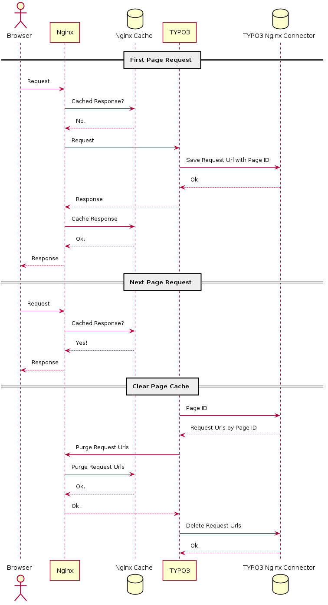

.. include:: Includes.txt

.. _start:

===============
Nginx Connector
===============

:Extension key:
   nginx_connector

:Version:
   |release|

:Language:
   en

:Authors:
   Alexander Nitsche

:Email:
   typo3@alexandernitsche.com

:Repository:
   https://extensions.typo3.org/extension/nginx_connector/

:License:
   Open Content License available from `www.opencontent.org/openpub/
   <http://www.opencontent.org/openpub/>`_

:Rendered:
   |today| GMT

This extension provides an Nginx cache connector which purges cached responses in Nginx along with cached pages in
TYPO3.

.. contents::
   :backlinks: top
   :class: compact-list
   :depth: 3
   :local:

Features
========

#. Configurable Nginx base url
#. Sends `PURGE {Nginx base url}/*` when flushing the frontend or all caches in the TYPO3 backend.
#. Sends `PURGE {Nginx request url}` for all cached responses associated with a page when flushing its page cache in the
   TYPO3 backend.
#. Detects and handles failed Nginx purge requests.

Out of Scope
============

- Nginx: Handling of incoming PURGE requests
- Nginx: Deleting of cached responses

The handling of cache purges on Nginx side can be managed by the non-free, commercial Nginx module
`ngx_cache_purge <https://nginx.org/en/docs/http/ngx_http_proxy_module.html#purger>`__ or by a custom
implementation, for example this
`Perl implementation <https://github.com/qbus-agentur/nginx_cache#nginx-configuration>`__
– Perl scripts are supported by Nginx natively.

Technical Background
====================

The Nginx cache can be used to cache responses from the TYPO3 frontend and thus to reduce server load significantly.
The creation and lifetime of cache entries depend on the TYPO3 response headers :aspect:`ETag`, :aspect:`Cache-Control`
and :aspect:`Expires` which are emitted if the TYPO3 configuration property
:ref:`config.sendCacheHeaders <t3tsref:setup-config-sendcacheheaders>` is set.
The cache entries are file based and have the hashed request url as filename.
Now in order to enable TYPO3 to flush the Nginx cache along with its own, this extension stores the request url
whenever TYPO3 is serving a cached page and links it to the cached page. As soon as the cache of that page should be
cleared, this extension sends a purge request to Nginx for every linked request url.

.. Replace image by uml diagram as soon as PlantUML is supported by TYPO3 docs generator.
.. .. include:: Images/nginx_connector_sequence_diagram.txt

TYPO3 extensions `nginx_connector` vs. `nginx_cache`
====================================================

This extension is based mainly on the architecture of the TYPO3 extension
`nginx_cache <https://github.com/qbus-agentur/nginx_cache>`__ but its implementation tries to be as clean and as close
as possible to the TYPO3 Core. Some differences are:

* improved handling of multiple purge requests
* smarter handling of failed purge requests
* calculating less but re-using more TYPO3 core cache params
* use sending of cache headers by TYPO3 core instead of custom implementation,
  e.g. caching of request urls with url queries is supported
* Nginx base url is configurable in order to support flushing caches from commandline

Nginx Cache vs. Varnish Cache
=============================

Other caches like Varnish Cache offer a query language to purge cached responses by meta data like headers.
This can be used to link a TYPO3 cached page to a Varnish cached response by sending the page id in a custom
header of the TYPO3 response and then send this page id with the purge request too -
see TYPO3 extension `varnish <https://gitlab.com/opsone_ch/typo3/varnish/>`__ for inspiration.
The Nginx cache unfortunately does not provide this mechanism and thus its handling adds complexity
to this extension by managing an own table of links between TYPO3 page cache and Nginx cached responses.

On the other side using the Nginx cache gives the advantage of using a combined web server and cache instance instead of
having to manage an additional cache server. The performance of both caches should be almost the same according to
various benchmarks in the world wide web.
